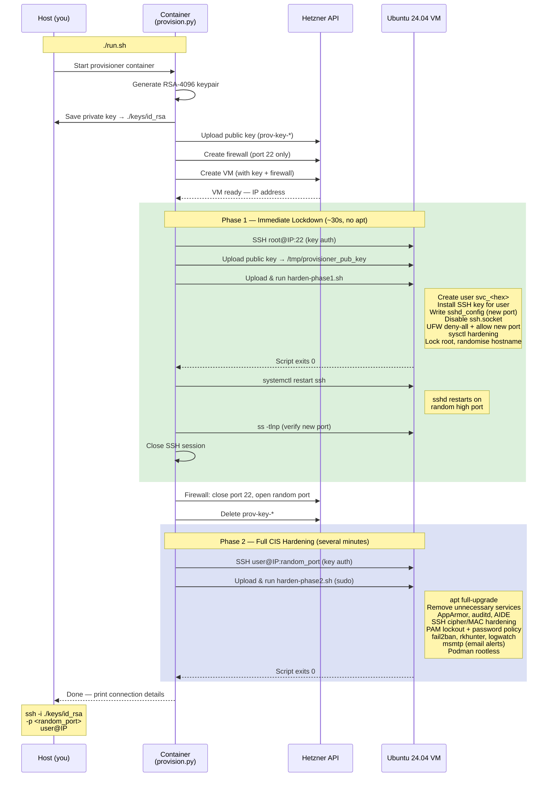
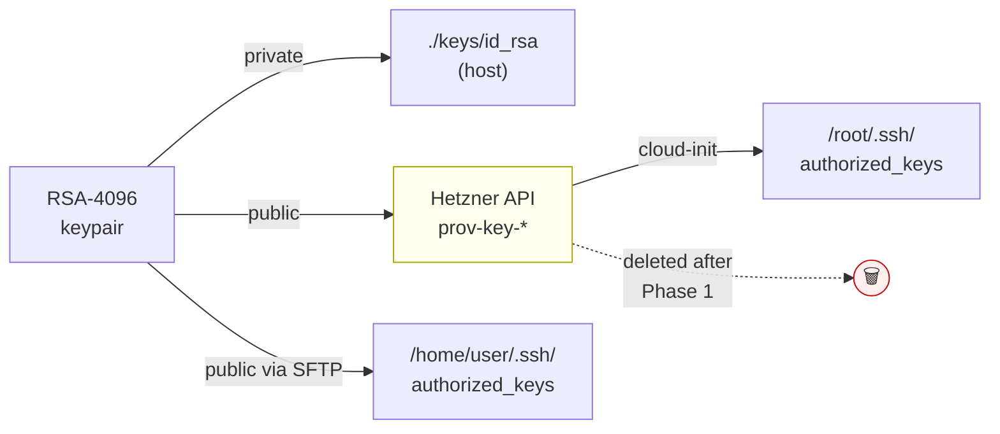

# Hetzner VM Hardening Provisioner

Fork of [AndyHS-506/Ubuntu-Hardening](https://github.com/AndyHS-506/Ubuntu-Hardening).

Automatically provisions a hardened Ubuntu 24.04 VM on Hetzner Cloud using a
**two-phase approach**: the VM is locked down within seconds of creation, before
the full CIS pipeline runs.

---

## Background

This project is based on `Cloud-Ubuntu-Hardening-2026.sh` from the upstream
repository, a comprehensive CIS Level 1/2 hardening script for Ubuntu 24.04
covering kernel parameters, AppArmor, auditd, PAM policy, SSH hardening,
filesystem restrictions, AIDE integrity checking, and more.

We kept the upstream script's structure and section numbering as a reference
point, but significantly reworked and extended it:

- **Split into two phases.** The upstream ran everything in one pass, leaving
  the VM exposed on port 22 with root access for the full duration (several
  minutes). We separated the work into an immediate lockdown phase (~30 seconds,
  no package installs) and a full CIS phase, so the attack surface is minimised
  from the very first seconds of the VM's life.
- **Added a Python orchestrator** (`provision.py`) that drives both phases via
  the Hetzner Cloud API: creates the VM and firewall, runs Phase 1, closes
  port 22 at the network level, reconnects as the new unprivileged user, then
  runs Phase 2.
- **SSH hardening split**: Phase 1 writes the complete `sshd_config` (custom
  port, key-only auth, AllowUsers). Phase 2 adds a drop-in at
  `sshd_config.d/50-cis-hardening.conf` for cipher and MAC hardening without
  overwriting Phase 1's access settings.
- **Replaced postfix with msmtp** for lightweight SMTP-relay-based alerting,
  wired as the system MTA so auditd, AIDE, rkhunter, and logwatch can all send
  email with no daemon running.
- **Added tooling**: fail2ban, needrestart, rkhunter (with nightly cron),
  logwatch, Podman rootless runtime.
- **Added `destroy.py`**: a companion CLI tool to cleanly tear down a server
  and all associated Hetzner resources (firewall, orphaned SSH keys).

---

## Provisioning Flow



### Key flow



---

## How It Works

### Phase 1 — Immediate lockdown (~30 seconds, no package installs)

Runs as root on port 22 immediately after the VM boots. No `apt` is involved —
pure configuration of pre-installed Ubuntu packages.

- Creates a random unprivileged user (`svc_<8hex>`) with key-only SSH access
- Moves SSH to a random high port (10 000 – 60 000); disables root login and
  password authentication entirely; restricts `AllowUsers` to the new account
- Enables UFW with default-deny-incoming; opens only the new SSH port
- TCP wrappers: `/etc/hosts.deny ALL:ALL`, allow only sshd
- sysctl: SYN cookies, reverse-path filtering, IPv6 disabled, ASLR, dmesg
  restrict, source-routing disabled
- Randomises the hostname; disables ctrl-alt-del reboot; locks the root account

**As soon as Phase 1 finishes, the Hetzner Cloud Firewall is updated: port 22
is closed and only the new random port is open.**

### Phase 2 — Full CIS hardening (several minutes)

Reconnects as the new user on the new port and runs the full hardening pipeline
via `sudo`.

- `apt full-upgrade` (security + kernel patches), `autoremove`, `clean`
- Removes 20+ unnecessary services (avahi, cups, NFS, Samba, SNMP, …)
- AppArmor (complain mode), auditd with comprehensive ruleset, AIDE file
  integrity (daily cron), rsyslog, journald (persistent), process accounting
- Kernel module blacklisting (cramfs, usb-storage, dccp, sctp, …); secure
  tmpfs mounts for `/tmp`, `/dev/shm`, `/var/tmp`
- SSH drop-in at `/etc/ssh/sshd_config.d/50-cis-hardening.conf`: cipher/MAC
  hardening, verbose logging — **does not overwrite Phase 1 settings**
- PAM: faillock (4 attempts, 15 min lock), pwquality (14-char min),
  SHA-512 hashing, password history (last 5), 30-min session timeout
- fail2ban (SSH protection), needrestart (auto-restart services after upgrades)
- rkhunter baseline + nightly scan (03:30 cron)
- logwatch daily digest (via msmtp if SMTP is configured)
- **msmtp** — lightweight SMTP client wired as system MTA (no postfix daemon);
  lets auditd, AIDE, rkhunter, logwatch send email alerts
- Podman rootless runtime for the provisioned user

---

## Usage

### 1. Configure `.env`

```bash
cp .env.example .env
nano .env          # fill in HCLOUD_TOKEN at minimum
```

Optional settings: region, server type, a fixed username, and SMTP credentials
for email alerts (auditd, AIDE, rkhunter, logwatch all use the same MTA).

### 2. Build and provision

```bash
chmod +x run.sh
./run.sh
```

The script builds the container image and runs the provisioner. Your private key
is saved to `./keys/id_rsa` on the host.

### 3. Connect

```
PROVISIONING COMPLETE
Server IP  : 1.2.3.4
SSH Port   : 48123
Username   : svc_a1b2c3d4
Private Key: /workspace/id_rsa  (mounted at ./keys/id_rsa on your host)

Connect with:
  ssh -i ./keys/id_rsa -p 48123 svc_a1b2c3d4@1.2.3.4
```

### Destroy a VM

To tear down a server and all associated Hetzner resources:

```bash
./run.sh destroy hardened-node-a1b2c3          # interactive confirm
./run.sh destroy hardened-node-a1b2c3 --yes    # non-interactive (CI)
./run.sh destroy 1.2.3.4                       # find by IP instead
```

This deletes: the server (releasing its primary IPv4/IPv6), attached firewalls,
and any orphaned `prov-key-*` SSH keys left from provisioning.
Floating IPs are listed as a warning but **not** auto-deleted.

---

## Testing

Unit tests and code coverage run entirely inside a dedicated container stage —
nothing is installed on the host.

```bash
./run.sh test
```

This builds the `test` stage of the Dockerfile (extends the production image,
adds `pytest` + `pytest-cov`), runs all tests, and prints a coverage report.
The build fails if coverage drops below 60 %.

```
tests/test_provision.py   — generate_ssh_keypair, generate_random_password,
                            _ColorFormatter, upload_string,
                            execute_remote_script, wait_for_ssh,
                            lockdown_firewall
tests/test_destroy.py     — find_server, find_attached_firewalls,
                            find_orphaned_prov_keys, find_floating_ips
```

Functions that require live Hetzner API access (`main()`, `destroy()`) are
integration concerns and are not unit tested here.

---

## Configuration reference

| Variable | Default | Description |
|---|---|---|
| `HCLOUD_TOKEN` | — | **Required.** Hetzner Cloud API token |
| `SERVER_NAME` | `hardened-node` | Name prefix — actual name is `<prefix>-<6hex>` |
| `SERVER_TYPE` | `cx22` | Hetzner server type |
| `LOCATION` | `fsn1` | Hetzner datacenter location |
| `OS_IMAGE` | `ubuntu-24.04` | Base OS image |
| `NEW_USER_NAME` | _(random)_ | Override the provisioned username |
| `SMTP_HOST` | — | SMTP relay hostname (enables msmtp + email alerts) |
| `SMTP_PORT` | `587` | SMTP port (STARTTLS) |
| `SMTP_USER` | — | SMTP username |
| `SMTP_PASS` | — | SMTP password |
| `SMTP_FROM` | — | Sender address |
| `ALERT_EMAIL` | — | Recipient for security digests |

---

## Files

| File | Purpose |
|---|---|
| `provision.py` | Orchestrator — Phase 1 → firewall lockdown → Phase 2 |
| `destroy.py` | Tear down a server and its Hetzner resources |
| `harden-phase1.sh` | Phase 1 script (immediate lockdown, no apt) |
| `harden-phase2.sh` | Phase 2 script (full CIS pipeline) |
| `Dockerfile` | Container image for the provisioner |
| `run.sh` | Wrapper: `./run.sh` to provision, `./run.sh destroy` to tear down |
| `.env.example` | Configuration template |
